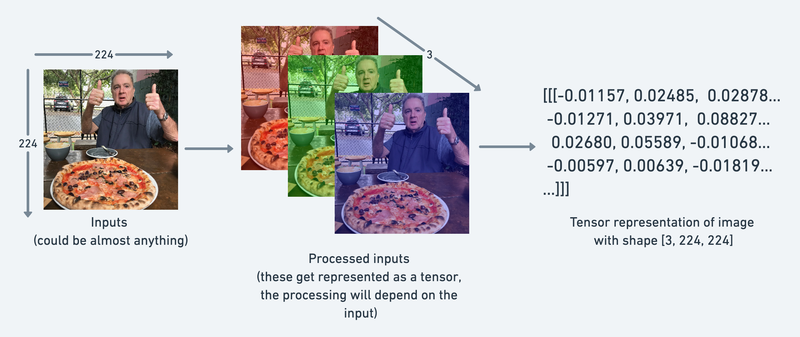
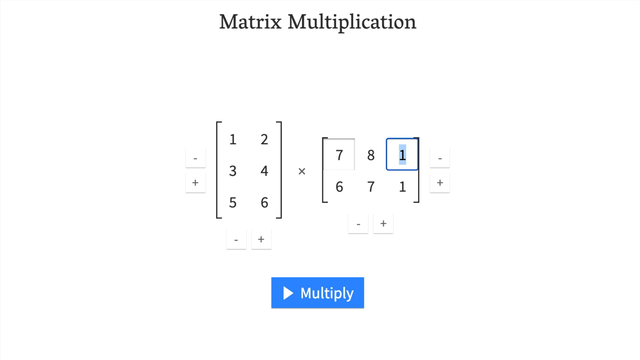

# 0 基础

## 什么是 PyTorch？

[PyTorch](https://pytorch.org/) 是一个开源的机器学习和深度学习框架。

## PyTorch 可用于什么？

PyTorch 允许您使用 Python 代码操作和处理数据，编写机器学习算法。

## 谁在使用 PyTorch？

许多世界上最大的技术公司，如 [Meta（Facebook）](https://ai.facebook.com/blog/pytorch-builds-the-future-of-ai-and-machine-learning-at-facebook/)、Tesla 和 Microsoft，以及人工智能研究公司，如 [OpenAI 使用 PyTorch](https://openai.com/blog/openai-pytorch/) 来推动研究并将机器学习引入他们的产品。


例如，特斯拉的人工智能负责人 Andrej Karpathy 曾多次发表演讲（[PyTorch DevCon 2019](https://youtu.be/oBklltKXtDE)、[特斯拉 AI Day 2021](https://youtu.be/j0z4FweCy4M?t=2904)），介绍了特斯拉如何使用 PyTorch 来驱动他们的自动驾驶计算机视觉模型。

PyTorch 也在其他行业中使用，比如在农业中用于 [驱动拖拉机上的计算机视觉](https://medium.com/pytorch/ai-for-ag-production-machine-learning-for-agriculture-e8cfdb9849a1)。

## 为什么使用 PyTorch？

机器学习研究人员喜欢使用 PyTorch。截至 2022 年 2 月，PyTorch 是 [Papers With Code 上使用最多的深度学习框架](https://paperswithcode.com/trends)，这是一个用于跟踪机器学习研究论文和附带代码存储库的网站。

PyTorch 还能够在幕后处理许多事情，如 GPU 加速（使您的代码运行更快）。

因此，您可以专注于处理数据和编写算法，而 PyTorch 将确保它运行得很快。

如果像特斯拉和 Meta（Facebook）这样的公司使用它来构建部署在数百个应用程序上、驾驶数千辆汽车并向数十亿人提供内容的模型，那么它在开发方面显然也是有能力的。

## 这一章内容

讲解机器学习和深度学习的基本构建块，即张量。

具体来说，将涵盖以下内容：

| **主题**                          | **内容**                                                     |
| --------------------------------- | ------------------------------------------------------------ |
| **张量简介**                      | 张量是所有机器学习和深度学习的基本构建块。                   |
| **创建张量**                      | 张量可以表示几乎任何类型的数据（图像、单词、数字表格）。     |
| **从张量中获取信息**              | 如果您可以将信息放入张量，那么您也会想要将它取出。           |
| **操作张量**                      | 机器学习算法（如神经网络）涉及以许多不同的方式操作张量，如加法、乘法、组合等。 |
| **处理张量形状**                  | 机器学习中最常见的问题之一是处理形状不匹配（尝试将错误形状的张量与其他张量混合）。 |
| **在张量上进行索引**              | 如果您已经对 Python 列表或 NumPy 数组进行了索引，那么与张量非常相似，只是它们可以具有更多的维度。 |
| **混合使用 PyTorch 张量和 NumPy** | PyTorch 处理张量（[`torch.Tensor`](https://pytorch.org/docs/stable/tensors.html)），NumPy 喜欢数组（[`np.ndarray`](https://numpy.org/doc/stable/reference/generated/numpy.ndarray.html)），有时您会希望混合和匹配它们。 |
| **可重复性**                      | 机器学习是非常实验性的，因为它使用了大量的*随机性*，有时您希望这种*随机性*不那么随机。 |
| **在 GPU 上运行张量**             | GPU（图形处理单元）可以使您的代码运行更快，PyTorch 可以轻松地在 GPU 上运行您的代码。 |

## 导入 PyTorch

> **注意：** 在运行本笔记本中的任何代码之前，您应该已经完成了 [PyTorch 设置步骤](https://pytorch.org/get-started/locally/)。

让我们从导入 PyTorch 并检查我们正在使用的版本开始。

```python
import torch
torch.__version__
```

```
'1.13.1+cu116'
```

太棒了，看起来我们有 PyTorch 1.10.0+。

这意味着如果您正在学习这些材料，您将看到与 PyTorch 1.10.0+ 最兼容的情况，但是如果您的版本号远高于此，您可能会注意到一些不一致性。

如果您遇到任何问题，请在课程的 [GitHub 讨论页面](https://github.com/mrdbourke/pytorch-deep-learning/discussions) 上发帖。

## 张量简介

现在我们已经导入了 PyTorch，是时候了解一下张量了。

张量是机器学习的基本构建块。

它们的任务是以数值方式表示数据。

例如，您可以将图像表示为形状为 `[3, 224, 224]` 的张量，其中 `[颜色通道数，高度，宽度]`，例如图像具有 `3` 个颜色通道（红色、绿色、蓝色），高度为 `224` 像素，宽度为 `224` 像素。



在张量术语（用于描述张量的语言）中，张量将具有三个维度，分别为 `颜色通道数`、`高度` 和 `宽度`。

但我们在提前预测。

让我们通过编码来了解更多关于张量的知识。


### 创建张量

PyTorch 热爱张量。以至于有一个完整的文档页面专门介绍了 [`torch.Tensor`](https://pytorch.org/docs/stable/tensors.html) 类。

你的第一个作业是[阅读 10 分钟的 `torch.Tensor` 文档](https://pytorch.org/docs/stable/tensors.html)。但你可以稍后再去阅读。

让我们来写代码吧。

首先，我们要创建的是**标量**。

标量是一个单独的数字，在张量术语中，它是一个零维张量。

```python
# 标量
scalar = torch.tensor(7)
scalar
```


    tensor(7)

看到上面打印出 `tensor(7)` 吗？

这意味着虽然 `scalar` 是一个单独的数字，但它的类型是 `torch.Tensor`。

我们可以使用 `ndim` 属性来检查张量的维度。


```python
scalar.ndim
```


    0

如果我们想要从张量中获取数字，怎么办？

也就是说，将它从 `torch.Tensor` 转换为 Python 整数？

为了做到这一点，我们可以使用 `item()` 方法。


```python
# 从张量中获取 Python 数字（仅适用于单元素张量）
scalar.item()
```


    7

好的，现在让我们看一个**向量**。

向量是一个单维张量，但可以包含许多数字。

例如，您可以有一个向量 `[3, 2]` 来描述您家中的 `[卧室数量，浴室数量]`。或者您可以有 `[3, 2, 2]` 来描述您家中的 `[卧室数量，浴室数量，停车位数量]`。

这里的重要趋势是，向量在它可以表示的内容上是灵活的（张量也是如此）。


```python
# 向量
vector = torch.tensor([7, 7])
vector
```


    tensor([7, 7])

太棒了，`vector` 现在包含了两个 7，这是我的最爱。

你认为它会有多少维度呢？


```python
# 检查 vector 的维度数
vector.ndim
```


    1

嗯，这很奇怪，`vector` 包含两个数字，但只有一个维度。

我告诉你一个技巧。

您可以通过张量在 PyTorch 中的括号数量来判断它的维度，只需计算一侧即可。

`vector` 有多少个方括号？

另一个重要的概念是张量的 `shape` 属性。形状告诉您元素在其中如何排列。

让我们来查看 `vector` 的形状。


```python
# 检查 vector 的形状
vector.shape
```


    torch.Size([2])

上面的输出是 `torch.Size([2])`，这意味着我们的向量的形状是 `[2]`。这是因为我们将两个元素放在了方括号中（`[7, 7]`）。

现在让我们看一个**矩阵**。


```python
# 矩阵
MATRIX = torch.tensor([[7, 8], 
                       [9, 10]])
MATRIX
```


    tensor([[ 7,  8],
            [ 9, 10]])

哇哦！更多的数字！矩阵与向量一样灵活，只是它们有一个额外的维度。


```python
# 检查维度数
MATRIX.ndim
```


    2

`MATRIX` 有两个维度（你有没有数一数一侧外面的方括号？）。

你认为它会有什么 `shape`？


```python
MATRIX.shape
```


    torch.Size([2, 2])

我们得到的输出是 `torch.Size([2, 2])`，因为 `MATRIX` 有两个元素深度和两个元素宽度。

那我们来创建一个**张量**吧？


```python
# 张量
TENSOR = torch.tensor([[[1, 2, 3],
                        [3, 6, 9],
                        [2, 4, 5]]])
TENSOR


```


    tensor([[[1, 2, 3],
             [3, 6, 9],
             [2, 4, 5]]])

哇哦！多好看的张量。

我想强调的是，张量可以表示几乎任何东西。

我们刚刚创建的这个可以是牛排和杏仁酱店的销售数字（我最喜欢的两种食物）。


张量有多少个维度呢？（提示：使用方括号计数技巧）


```python
# 检查 TENSOR 的维度数
TENSOR.ndim
```


    3

它的形状是多少？


```python
# 检查 TENSOR 的形状
TENSOR.shape
```


    torch.Size([1, 3, 3])

好的，它输出了 `torch.Size([1, 3, 3])`。

维度是从外到内排列的。

这意味着有 1 个 3x3 的维度。


> **注意：** 你可能会注意到我在 `scalar` 和 `vector` 中使用小写字母，在 `MATRIX` 和 `TENSOR` 中使用大写字母。这是有意的。在实践中，标量和向量通常用小写字母表示，例如 `y` 或 `a`。而矩阵和张量通常用大写字母表示，例如 `X` 或 `W`。
>
> 你还可能注意到矩阵和张量的名称可以互换使用。这是常见的。由于在 PyTorch 中通常处理 `torch.Tensor`（因此有张量名称），但其中的内容的形状和维度将决定它实际上是什么。

让我们总结一下。

| 名称     | 它是什么？                                                   | 维度数                                         | 大写或小写（通常/示例） |
| -------- | ------------------------------------------------------------ | ---------------------------------------------- | ----------------------- |
| **标量** | 一个单独的数字                                               | 0                                              | 小写（`a`）             |
| **向量** | 有方向的数字（例如带有方向的风速），但也可以包含许多其他数字 | 1                                              | 小写（`y`）             |
| **矩阵** | 数字的 2 维数组                                              | 2                                              | 大写（`Q`）             |
| **张量** | 数字的 n 维数组                                              | 可以是任何数字，0 维张量是标量，1 维张量是向量 | 大写（`X`）             |


### 随机张量

我们已经确定张量表示某种形式的数据。

而机器学习模型，如神经网络，则操作并寻找张量中的模式。

但是在使用 PyTorch 构建机器学习模型时，你很少会手动创建张量（就像我们一直在做的那样）。

相反，机器学习模型通常以大型随机数张量开始，并在处理数据以更好地表示数据时调整这些随机数。

实质上：

`从随机数开始 -> 查看数据 -> 更新随机数 -> 查看数据 -> 更新随机数...`

作为数据科学家，你可以定义机器学习模型开始（初始化）、查看数据（表示）和更新（优化）其随机数的方式。

稍后我们将亲自动手操作这些步骤。

现在，让我们看看如何创建一个随机数张量。

我们可以使用 [`torch.rand()`](https://pytorch.org/docs/stable/generated/torch.rand.html) 并传递 `size` 参数来实现这一点。

```python
# 创建一个大小为 (3, 4) 的随机数张量
random_tensor = torch.rand(size=(3, 4))
random_tensor, random_tensor.dtype
```

```
(tensor([[0.6541, 0.4807, 0.2162, 0.6168],
         [0.4428, 0.6608, 0.6194, 0.8620],
         [0.2795, 0.6055, 0.4958, 0.5483]]),
 torch.float32)
```

`torch.rand()` 的灵活性在于我们可以调整 `size` 为任何我们想要的大小。

例如，假设你想要一个随机数张量，其形状为常见的图像形状 `[224, 224, 3]`（`[高度，宽度，颜色通道]`）。

```python
# 创建一个大小为 (224, 224, 3) 的随机数张量
random_image_size_tensor = torch.rand(size=(224, 224, 3))
random_image_size_tensor.shape, random_image_size_tensor.ndim
```

```
(torch.Size([224, 224, 3]), 3)
```

### 零zeros和一ones

有时你只想用零或一来填充张量。

这在掩码（例如，用零掩盖一个张量中的某些值，以通知模型不要学习它们）中经常发生。

让我们创建一个全零的张量，使用 [`torch.zeros()`](https://pytorch.org/docs/stable/generated/torch.zeros.html)。

同样，`size` 参数发挥作用。

```python
# 创建一个全零的张量
zeros = torch.zeros(size=(3, 4))
zeros, zeros.dtype
```

```
(tensor([[0., 0., 0., 0.],
         [0., 0., 0., 0.],
         [0., 0., 0., 0.]]),
 torch.float32)
```

我们可以使用 [`torch.ones()` ](https://pytorch.org/docs/stable/generated/torch.ones.html) 来创建一个全为一的张量。

```python
# 创建一个全为一的张量
ones = torch.ones(size=(3, 4))
ones, ones.dtype
```

```
(tensor([[1., 1., 1., 1.],
         [1., 1., 1., 1.],
         [1., 1., 1., 1.]]),
 torch.float32)
```

### 创建范围range和类似的张量tensors like

有时你可能想要一系列数字，例如 1 到 10 或 0 到 100。

你可以使用 `torch.arange(start, end, step)` 来实现。

其中：

* `start` = 范围的起始位置（例如 0）
* `end` = 范围的结束位置（例如 10）
* `step` = 每个值之间的步长（例如 1）

> **注意：** 在 Python 中，你可以使用 `range()` 来创建范围。但是在 PyTorch 中，`torch.range()` 已被弃用，并且在未来可能会出现错误。

```python
# 使用 torch.arange()，torch.range() 已被弃用
zero_to_ten_deprecated = torch.range(0, 10) # 注意：未来可能会出现错误

# 创建值从 0 到 10 的一系列值
zero_to_ten = torch.arange(start=0, end=10, step=1)
zero_to_ten
```

```
/tmp/ipykernel_3695928/193451495.py:2: UserWarning: torch.range is deprecated and will be removed in a future release because its behavior is inconsistent with Python's range builtin. Instead, use torch.arange, which produces values in [start, end).
  zero_to_ten_deprecated = torch.range(0, 10) # Note: this may return an error in the future
```

```
tensor([0, 1, 2, 3, 4, 5, 6, 7, 8, 9])
```

有时你可能想要一个与另一个张量具有相同形状的相同类型的张量。

例如，一个张量的形状为 0 的全部零张量。

你可以使用 [`torch.zeros_like(input)`](https://pytorch.org/docs/stable/generated/torch.zeros_like.html) 或 [`torch.ones_like(input)`](https://pytorch.org/docs/1.9.1/generated/torch.ones_like.html) 来实现，它们分别返回一个以 `input` 的形状填充了零或一的张量。

```python
# 也可以创建一个与另一个张量具有相同形状的全部零张量
ten_zeros = torch.zeros_like(input=zero_to_ten) # 形状相同
ten_zeros
```

```
tensor([0, 0, 0, 0, 0, 0, 0, 0, 0, 0])
```

### 张量数据类型

PyTorch 中有许多不同的[张量数据类型可用](https://pytorch.org/docs/stable/tensors.html#data-types)。

有些是特定于 CPU 的，有些对 GPU 更好。

了解哪种是哪种可能需要一些时间。

通常，如果在任何地方看到 `torch.cuda`，则表示张量正在用于 GPU（因为 Nvidia GPU 使用名为 CUDA 的计算工具包）。

最常见的类型（通常是默认的）是 `torch.float32` 或 `torch.float`。

这被称为 "32 位浮点"。

但还有 16 位浮点数（`torch.float16` 或 `torch.half`）和 64 位浮点数（`torch.float64` 或 `torch.double`）。

为了使事情变得更加混乱，还有 8 位、16 位、32 位和 64 位整数。

还有更多！

> **注意：** 整数integer是一个数字，例如 `7`，而浮点数带有小数 `7.0`。

这一切的原因都与**计算中的精度**有关。

精度是用于描述数字的详细程度。

精度值越高（8、16、32），描述数字的细节和数据越多。

在深度学习和数值计算中，这很重要，因为你正在执行如此多的操作，你拥有的细节越多，进行计算所需的计算量就越大。

因此，低精度数据类型通常计算速度更快，但在评估指标（计算速度更快但准确性较低）方面会牺牲一些性能。

> **资源：**
>
> * 请参阅[PyTorch文档以获取所有可用张量数据类型的列表](https://pytorch.org/docs/stable/tensors.html#data-types)。
> * 阅读[维基百科页面，了解计算中的精度](https://en.wikipedia.org/wiki/Precision_(computer_science))是什么。

让我们看看如何使用特定数据类型创建一些张量。我们可以使用 `dtype` 参数来实现。

```python
# 张量的默认数据类型是 float32
float_32_tensor = torch.tensor([3.0, 6.0, 9.0],
                               dtype=None, # 默认为 None，即 torch.float32 或传递的任何数据类型
                               device=None, # 默认为 None，使用默认张量类型
                               requires_grad=False) # 如果为 True，则记录在张量上执行的操作

float_32_tensor.shape, float_32_tensor.dtype, float_32_tensor.device
```

```
(torch.Size([3]), torch.float32, device(type='cpu'))
```

除了形状问题（张量形状不匹配），你将在 PyTorch 中遇到的另外两个最常见的问题是数据类型和设备问题。

例如，其中一个张量是 `torch.float32`，另一个是 `torch.float16`（PyTorch 通常希望张量具有相同的格式）。

或者一个张量位于 CPU 上，另一个位于 GPU 上（PyTorch 希望在相同设备上进行张量之间的计算）。

稍后我们将看到更多关于设备的讨论。

现在，让我们创建一个 `dtype=torch.float16` 的张量。

```python
float_16_tensor = torch.tensor([3.0, 6.0, 9.0],
                               dtype=torch.float16) # torch.half 也可以工作

float_16_tensor.dtype
```


    torch.float16

### 从张量获取信息

一旦你创建了张量（或其他人或 PyTorch 模块为你创建了它们），你可能希望从中获取一些信息。

我们之前已经看到了这些信息，但你可能想要了解张量的三个最常见属性：

* `shape` - 张量的形状是什么？（一些操作需要特定的形状规则）
* `dtype` - 张量中的元素存储在什么数据类型中？
* `device` - 张量存储在什么设备上？（通常是 GPU 或 CPU）

让我们创建一个随机张量并查找有关它的详细信息。

```python
# 创建一个张量
some_tensor = torch.rand(3, 4)

# 查找有关它的详细信息
print(some_tensor)
print(f"张量的形状：{some_tensor.shape}")
print(f"张量的数据类型：{some_tensor.dtype}")
print(f"张量存储在的设备：{some_tensor.device}") # 默认为 CPU
```

    tensor([[0.4688, 0.0055, 0.8551, 0.0646],
            [0.6538, 0.5157, 0.4071, 0.2109],
            [0.9960, 0.3061, 0.9369, 0.7008]])
    张量的形状：torch.Size([3, 4])
    张量的数据类型：torch.float32
    张量存储在的设备：cpu


> **注意：** 当在 PyTorch 中遇到问题时，很常见的问题之一往往与上面提到的三个属性之一有关。

## 操作张量（张量运算）

在深度学习中，数据（图像、文本、视频、音频、蛋白质结构等）被表示为张量。

模型通过研究这些张量并对张量执行一系列操作（可能是 1,000,000s+）来创建输入数据中模式的表示。

这些操作通常是以下几种基本操作之间的精妙协调：

* 加法
* 减法
* 乘法（逐元素）
* 除法
* 矩阵乘法

这就是全部。当然，还有一些其他操作，但这些是神经网络的基本构建块。

将这些构建块以正确的方式堆叠起来，你可以创建最复杂的神经网络（就像积木一样！）。

### 基本操作

让我们从一些基本操作开始，加法（`+`）、减法（`-`）和乘法（`*`）。

它们的工作方式就像你想象的那样。

```python
# 创建一个数值张量并将一个数字加到它上面
tensor = torch.tensor([1, 2, 3])
tensor + 10
```

```
tensor([11, 12, 13])
```

---

```python
# 将其乘以 10
tensor * 10
```

```
tensor([10, 20, 30])
```

请注意，上面的张量值最终不会变成 `tensor([110, 120, 130])`，这是因为张量内部的值不会更改，除非重新分配。

```python
# 除非重新分配，否则张量不会改变
tensor
```

```
tensor([1, 2, 3])
```

让我们减去一个数字，这次我们将重新分配 `tensor` 变量。

```python
# 减去并重新分配
tensor = tensor - 10
tensor
```

```
tensor([-9, -8, -7])
```

---

```python
# 加上并重新分配
tensor = tensor + 10
tensor
```

```
tensor([1, 2, 3])
```

PyTorch 还有许多内置函数，如 [`torch.mul()`](https://pytorch.org/docs/stable/generated/torch.mul.html)（multiplication的缩写）和 [`torch.add()`](https://pytorch.org/docs/stable/generated/torch.add.html) 来执行基本操作。

```python
# 也可以使用 torch 函数
torch.multiply(tensor, 10)
```

```
tensor([10, 20, 30])
```

---

```python
# 原始张量仍然不变
tensor
```

```
tensor([1, 2, 3])
```

但通常使用运算符符号，如 `*`，而不是 `torch.mul()`。

```python
# 逐元素乘法（每个元素都与其相对应的元素相乘，索引 0->0，1->1，2->2）
print(tensor, "*", tensor)
print("相等于：", tensor * tensor)
```

```
tensor([1, 2, 3]) * tensor([1, 2, 3])
Equals: tensor([1, 4, 9])
```

### 矩阵乘法（你所需要的一切）

在机器学习和深度学习算法（如神经网络）中，最常见的操作之一是[矩阵乘法](https://www.mathsisfun.com/algebra/matrix-multiplying.html)。

PyTorch 在 [`torch.matmul()`](https://pytorch.org/docs/stable/generated/torch.matmul.html) 方法中实现了矩阵乘法功能。

记住矩阵乘法的两个主要规则：

1. **内部尺寸** 必须匹配：
   * `(3, 2) @ (3, 2)` 不起作用
   * `(2, 3) @ (3, 2)` 起作用
   * `(3, 2) @ (2, 3)` 起作用

2. 结果矩阵具有 **外部尺寸** 的形状：
   * `(2, 3) @ (3, 2)` -> `(2, 2)`
   * `(3, 2) @ (2, 3)` -> `(3, 3)`

> **注意：** 在 Python 中，“`@`”是矩阵乘法的符号。

> **资源：** 你可以在 PyTorch 文档中查看 `torch.matmul()` 的所有矩阵乘法规则 [链接](https://pytorch.org/docs/stable/generated/torch.matmul.html)。

让我们创建一个张量并对其执行逐元素乘法和矩阵乘法。

```python
import torch
tensor = torch.tensor([1, 2, 3])
tensor.shape
```

```
torch.Size([3])
```

逐元素乘法和矩阵乘法之间的区别在于值的添加。

对于具有值 `[1, 2, 3]` 的 `tensor` 变量：

| 操作           | 计算                            | 代码                    |
| -------------- | ------------------------------- | ----------------------- |
| **逐元素乘法** | `[1*1, 2*2, 3*3]` = `[1, 4, 9]` | `tensor * tensor`       |
| **矩阵乘法**   | `[1*1 + 2*2 + 3*3]` = `[14]`    | `tensor.matmul(tensor)` |

```python
# 逐元素矩阵乘法
tensor * tensor
```

```
tensor([1, 4, 9])
```

---

```python
# 矩阵乘法
torch.matmul(tensor, tensor)
```

```
tensor(14)
```

---

```python
# 也可以使用 "@" 符号进行矩阵乘法，不过不推荐
tensor @ tensor
```

```
tensor(14)
```

你可以手动执行矩阵乘法，但不推荐这样做。

内置的 `torch.matmul()` 方法速度更快。

```python
%%time
# 手动执行矩阵乘法
# （尽量避免使用 for 循环进行操作，它们在计算上很昂贵）
value = 0
for i in range(len(tensor)):
  value += tensor[i] * tensor[i]
value
```

```
CPU times: user 773 µs, sys: 0 ns, total: 773 µs
Wall time: 499 µs
```

---

```python
%%time
# 使用 torch.matmul() 执行矩阵乘法
torch.matmul(tensor, tensor)
```

```
CPU times: user 146 µs, sys: 83 µs, total: 229 µs
Wall time: 171 µs
```

```
tensor(14)
```
> PyTorch 将这两个一维张量视为列向量和行向量。它会自动将其中一个张量转换为列向量（n x 1），另一个转换为行向量（1 x n），然后进行矩阵乘法。

## 形状必须正确
### 深度学习中最常见的错误（形状错误）

由于深度学习的大部分工作涉及矩阵的乘法和操作，并且矩阵对于可以组合的形状和大小有严格的规则，所以在深度学习中，你最常遇到的错误之一就是形状不匹配。


```python
# 形状必须正确  
tensor_A = torch.tensor([[1, 2],
                         [3, 4],
                         [5, 6]], dtype=torch.float32)

tensor_B = torch.tensor([[7, 10],
                         [8, 11], 
                         [9, 12]], dtype=torch.float32)

torch.matmul(tensor_A, tensor_B) # (this will error)
```


    ---------------------------------------------------------------------------
    
    RuntimeError                              Traceback (most recent call last)
    
    /home/daniel/code/pytorch/pytorch-course/pytorch-deep-learning/00_pytorch_fundamentals.ipynb Cell 75 in <cell line: 10>()
          <a href='vscode-notebook-cell://ssh-remote%2B7b22686f73744e616d65223a22544954414e2d525458227d/home/daniel/code/pytorch/pytorch-course/pytorch-deep-learning/00_pytorch_fundamentals.ipynb#Y134sdnNjb2RlLXJlbW90ZQ%3D%3D?line=1'>2</a> tensor_A = torch.tensor([[1, 2],
          <a href='vscode-notebook-cell://ssh-remote%2B7b22686f73744e616d65223a22544954414e2d525458227d/home/daniel/code/pytorch/pytorch-course/pytorch-deep-learning/00_pytorch_fundamentals.ipynb#Y134sdnNjb2RlLXJlbW90ZQ%3D%3D?line=2'>3</a>                          [3, 4],
          <a href='vscode-notebook-cell://ssh-remote%2B7b22686f73744e616d65223a22544954414e2d525458227d/home/daniel/code/pytorch/pytorch-course/pytorch-deep-learning/00_pytorch_fundamentals.ipynb#Y134sdnNjb2RlLXJlbW90ZQ%3D%3D?line=3'>4</a>                          [5, 6]], dtype=torch.float32)
          <a href='vscode-notebook-cell://ssh-remote%2B7b22686f73744e616d65223a22544954414e2d525458227d/home/daniel/code/pytorch/pytorch-course/pytorch-deep-learning/00_pytorch_fundamentals.ipynb#Y134sdnNjb2RlLXJlbW90ZQ%3D%3D?line=5'>6</a> tensor_B = torch.tensor([[7, 10],
          <a href='vscode-notebook-cell://ssh-remote%2B7b22686f73744e616d65223a22544954414e2d525458227d/home/daniel/code/pytorch/pytorch-course/pytorch-deep-learning/00_pytorch_fundamentals.ipynb#Y134sdnNjb2RlLXJlbW90ZQ%3D%3D?line=6'>7</a>                          [8, 11], 
          <a href='vscode-notebook-cell://ssh-remote%2B7b22686f73744e616d65223a22544954414e2d525458227d/home/daniel/code/pytorch/pytorch-course/pytorch-deep-learning/00_pytorch_fundamentals.ipynb#Y134sdnNjb2RlLXJlbW90ZQ%3D%3D?line=7'>8</a>                          [9, 12]], dtype=torch.float32)
    ---> <a href='vscode-notebook-cell://ssh-remote%2B7b22686f73744e616d65223a22544954414e2d525458227d/home/daniel/code/pytorch/pytorch-course/pytorch-deep-learning/00_pytorch_fundamentals.ipynb#Y134sdnNjb2RlLXJlbW90ZQ%3D%3D?line=9'>10</a> torch.matmul(tensor_A, tensor_B)


    RuntimeError: mat1 and mat2 shapes cannot be multiplied (3x2 and 3x2)


我们可以通过使`tensor_A`和`tensor_B`的内部维度匹配来实现矩阵乘法。

其中一种方法是使用**转置**（交换给定张量的维度）。

您可以使用PyTorch执行转置，方法有两种：

* `torch.transpose(input, dim0, dim1)` - 其中`input`是要转置的目标张量，`dim0`和`dim1`是要交换的维度。
* `tensor.T` - 其中`tensor`是要转置的目标张量。

让我们尝试后者。

```python
# 查看tensor_A和tensor_B
print(tensor_A)
print(tensor_B)
```

```python
tensor([[1., 2.],
        [3., 4.],
        [5., 6.]])
tensor([[ 7., 10.],
        [ 8., 11.],
        [ 9., 12.]])
```

```python
# 查看tensor_A和tensor_B.T
print(tensor_A)
print(tensor_B.T)
```

```python
tensor([[1., 2.],
        [3., 4.],
        [5., 6.]])
tensor([[ 7.,  8.,  9.],
        [10., 11., 12.]])
```

```python
# 当tensor_B被转置时，操作生效
print(f"原始形状：tensor_A = {tensor_A.shape}，tensor_B = {tensor_B.shape}\n")
print(f"新形状：tensor_A = {tensor_A.shape}（与上面相同），tensor_B.T = {tensor_B.T.shape}\n")
print(f"相乘：{tensor_A.shape} * {tensor_B.T.shape} <- 内部维度匹配\n")
print("输出：\n")
output = torch.matmul(tensor_A, tensor_B.T)
print(output) 
print(f"\n输出形状：{output.shape}")
```

```python
原始形状：tensor_A = torch.Size([3, 2])，tensor_B = torch.Size([3, 2])

新形状：tensor_A = torch.Size([3, 2])（与上面相同），tensor_B.T = torch.Size([2, 3])

相乘：torch.Size([3, 2]) * torch.Size([2, 3]) <- 内部维度匹配

输出：

tensor([[ 27.,  30.,  33.],
        [ 61.,  68.,  75.],
        [ 95., 106., 117.]])
        
输出形状：torch.Size([3, 3])
```

您还可以使用[`torch.mm()`](https://pytorch.org/docs/stable/generated/torch.mm.html)，它是`torch.matmul()`的缩写。

```python
# torch.mm是torch.matmul()的缩写
torch.mm(tensor_A, tensor_B.T)
```

```python
tensor([[ 27.,  30.,  33.],
        [ 61.,  68.,  75.],
        [ 95., 106., 117.]])
```

如果没有进行转置，将不满足矩阵乘法的规则，会出现上面的错误。

那么如何进行可视化呢？



矩阵乘法可视化：[Matrix Multiplication](http://matrixmultiplication.xyz/)

> **注意：**这样的矩阵乘法也被称为两个矩阵的[**点积**](https://www.mathsisfun.com/algebra/vectors-dot-product.html)。

神经网络充满了矩阵乘法和点积。

[`torch.nn.Linear()`](https://pytorch.org/docs/1.9.1/generated/torch.nn.Linear.html)模块（稍后我们将在实际操作中看到它），也称为前馈feed-forward层或全连接fully connected层，实现了输入`x`和权重矩阵`A`之间的矩阵乘法。

$$
y = x\cdot{A^T} + b
$$

其中：

* `x`是层的输入（深度学习是一堆像`torch.nn.Linear()`和其他层叠在一起的层）。
* `A`是由该层创建的权重矩阵，它开始时是随机数，会随着神经网络学习更好地表示数据中的模式patterns而调整（请注意"`T`"，这是因为权重矩阵被转置）。
    * 注意：您可能经常看到使用`W`或其他字母如`X`来展示权重矩阵。
* `b`是用于略微偏移offset权重weights和输入的偏置项bias。
* `y`是输出（对输入的处理，以期发现其中的模式）。

这是一个线性函数（您可能在高中或其他地方见过类似$y = mx+b$的东西），可以用来绘制一条直线！

>### 示例
>
>假设我们有一个输入向量 \( x \) 的维度为 `[2]`（即它有2个元素），并且我们想要通过一个线性层将它转换为一个维度为 `[3]` 的输出向量 \( y \)。这意味着我们的线性层需要有一个 `2x3` 的权重矩阵 \( A \) 和一个维度为 `[3]` 的偏置向量 \( b \)。
>
>#### 代码实现
>
>1. **定义层**: 我们首先定义一个 `torch.nn.Linear(2, 3)` 的层。这里的 `2` 是输入特征的数量，而 `3` 是输出特征的数量。
>
>```python
>import torch
>linear_layer = torch.nn.Linear(2, 3)
>```
>
>2. **初始化输入**: 接着，我们创建一个大小为 `[2]` 的输入向量。
>
>```python
>x = torch.tensor([1.0, 2.0])
>```
>
>3. **进行前向传播**: 最后，我们通过这个层传递输入 `x`。
>
>```python
>y = linear_layer(x)
>```
>
>在这个例子中，`linear_layer(x)` 实际上执行了 \( $x \cdot A^T + b$ \) 的计算，其中 $A$ 和 $b$  是层的内部参数。
>
>#### 输出结果
>输出 `y` 是一个维度为 `[3]` 的张量，它是输入 `x` 经过线性变换后的结果。
>
>这个过程就是 `torch.nn.Linear` 模块的基本工作方式。在实际应用中，这个模块通常被用在神经网络的构建中，作为网络的一部分来学习输入数据到输出数据之间的映射关系。

让我们尝试使用线性层进行一些操作。

尝试更改`in_features`和`out_features`的值，看看会发生什么。

是否注意到与形状有关的问题？

```python
# 由于线性层从一个随机的权重矩阵开始，让我们使其可复现
torch.manual_seed(42)
# 这使用了矩阵乘法
linear = torch.nn.Linear(in_features=2, # in_features = 匹配输入的内部维度 
                         out_features=6) # out_features = 描述外部维度 
x = tensor_A
output = linear(x)
print(f"输入形状：{x.shape}\n")
print(f"输出:\n{output}\n\n输出形状：{output.shape}")
```

```python
输入形状：torch.Size([3, 2])

输出:
tensor([[2.2368, 1.2292, 0.4714, 0.3864, 0.1309, 0.9838],     
        [4.4919, 2.1970, 0.4469, 0.5285, 0.3401, 2.4777],
        [6.7469, 3.1648, 0.4224, 0.6705, 0.5493, 3.9716]],
       grad_fn=<AddmmBackward0>)

输出形状：torch.Size([3, 6])
```


*当您开始深入研究神经网络层并构建自己的层时，您会发现矩阵乘法无处不在。 **来源：** [Working Class Deep Learner - by Mark Saroufim (substack.com)](https://marksaroufim.substack.com/p/working-class-deep-learner)*

### 查找最小值、最大值、平均值、总和等（聚合aggregation）

现在我们已经看到了一些操作张量的方法，让我们运行一些聚合操作，将其从更多的值转化为更少的值。

首先，我们将创建一个张量，然后找到它的最大值、最小值、平均值和总和。

```python
# 创建一个张量
x = torch.arange(0, 100, 10)
x
```

```python
tensor([ 0, 10, 20, 30, 40, 50, 60, 70, 80, 90])
```

现在让我们执行一些聚合操作。

```python
print(f"最小值: {x.min()}")
print(f"最大值: {x.max()}")
# print(f"平均值: {x.mean()}") # 这会导致错误
print(f"平均值: {x.type(torch.float32).mean()}") # 没有float数据类型将无法生效
print(f"总和: {x.sum()}")
```

```
最小值: 0
最大值: 90
平均值: 45.0
总和: 450
```

> **注意：**`torch.mean()`，要求张量是float数据类型的，否则操作将失败。

您还可以使用`torch`方法执行相同的操作。

```python
torch.max(x), torch.min(x), torch.mean(x.type(torch.float32)), torch.sum(x)
```

```
(tensor(90), tensor(0), tensor(45.), tensor(450))
```

### 最小/最大值的位置索引

您还可以使用[`torch.argmax()`](https://pytorch.org/docs/stable/generated/torch.argmax.html)和[`torch.argmin()`](https://pytorch.org/docs/stable/generated/torch.argmin.html)来找到张量中的最大值或最小值发生的索引。这对于仅想要最高（或最低）值发生的位置而不是实际值本身的情况很有帮助（我们将在稍后的部分中使用[softmax激活函数](https://pytorch.org/docs/stable/generated/torch.nn.Softmax.html)时看到这一点）。

```python
# 创建一个张量
tensor = torch.arange(10, 100, 10)
print(f"张量: {tensor}")

# 返回最大值和最小值的索引
print(f"最大值的索引: {tensor.argmax()}")
print(f"最小值的索引: {tensor.argmin()}")
```

```
张量: tensor([10, 20, 30, 40, 50, 60, 70, 80, 90])
最大值的索引: 8
最小值的索引: 0
```

### 更改张量数据类型

正如前面所提到的，深度学习操作的一个常见问题是您的张量具有不同的数据类型。

如果一个张量是`torch.float64`，而另一个是`torch.float32`，您可能会遇到一些错误。

但是有解决方法。

您可以使用[`torch.Tensor.type(dtype=None)`](https://pytorch.org/docs/stable/generated/torch.Tensor.type.html)，其中`dtype`参数是您想要使用的数据类型。

首先，我们将创建一个张量并检查其数据类型（默认为`torch.float32`）。

```python
# 创建一个张量并检查其数据类型
tensor = torch.arange(10., 100., 10.)
tensor.dtype
```

```
torch.float32
```

现在，我们将创建另一个与前面相同的张量，但将其数据类型更改为`torch.float16`。

```python
# 创建一个float16张量
tensor_float16 = tensor.type(torch.float16)
tensor_float16
```

```
tensor([10., 20., 30., 40., 50., 60., 70., 80., 90.], dtype=torch.float16)
```

我们也可以使用`torch.int8`张量进行类似操作。

```python
# 创建一个int8张量
tensor_int8 = tensor.type(torch.int8)
tensor_int8
```

```
tensor([10, 20, 30, 40, 50, 60, 70, 80, 90], dtype=torch.int8)
```

> **注意：**不同的数据类型可能一开始会让人感到困惑。但可以这样考虑，数字越低（例如32、16、8），计算机存储该值的精度就越低。并且随着存储量减少，通常会导致更快的计算速度和更小的总模型大小。基于移动设备的神经网络通常使用8位整数，比其float32对应项精度较低，但运行速度更快。有关更多信息，请阅读[计算中的精度](https://en.wikipedia.org/wiki/Precision_(computer_science))。

> **参考：**[`torch.Tensor`文档](https://pytorch.org/docs/stable/tensors.html)

### 重塑reshaping、堆叠stacking、挤压squeezing和展开unsqueezing

通常，您会希望重塑或更改张量的维度，而不实际更改其中的值。

为此，一些常用的方法包括：

| 方法                                                         | 一句话描述                                                   |
| ------------------------------------------------------------ | ------------------------------------------------------------ |
| [`torch.reshape(input, shape)`](https://pytorch.org/docs/stable/generated/torch.reshape.html#torch.reshape) | 重塑`input`为`shape`（如果兼容），也可以使用`torch.Tensor.reshape()`。 |
| [`Tensor.view(shape)`](https://pytorch.org/docs/stable/generated/torch.Tensor.view.html) | 返回原始张量的具有不同`shape`的视图，但与原始张量共享相同的数据。 |
| [`torch.stack(tensors, dim=0)`](https://pytorch.org/docs/1.9.1/generated/torch.stack.html) | 沿新维度（`dim`）连接一系列`tensors`，所有`tensors`的大小必须相同。 |
| [`torch.squeeze(input)`](https://pytorch.org/docs/stable/generated/torch.squeeze.html) | 挤压`input`以删除所有值为`1`的维度。                         |
| [`torch.unsqueeze(input, dim)`](https://pytorch.org/docs/1.9.1/generated/torch.unsqueeze.html) | 在`dim`处添加值为`1`的维度到`input`中。                      |
| [`torch.permute(input, dims)`](https://pytorch.org/docs/stable/generated/torch.permute.html) | 返回原始`input`的*视图*，其维度被重新排列为`dims`。          |

为什么要使用这些方法？

因为深度学习模型（神经网络）都是关于以某种方式操作张量。由于矩阵乘法的规则，如果维度不匹配，您将遇到错误。这些方法帮助您确保张量的正确元素与其他张量的正确元素混合。

让我们来试试。

首先，我们将创建一个张量。

```python
# 创建一个张量
import torch
x = torch.arange(1., 8.)
x, x.shape
```

```
(tensor([1., 2., 3., 4., 5., 6., 7.]), torch.Size([7]))
```

现在让我们使用`torch.reshape()`添加一个额外的维度。

```python
# 添加一个额外的维度
x_reshaped = x.reshape(1, 7)
x_reshaped, x_reshaped.shape
```

```
(tensor([[1., 2., 3., 4., 5., 6., 7.]]), torch.Size([1, 7]))
```

我们还可以使用`torch.view()`改变视图。

```python
# 更改视图（保持与原始数据相同但更改视图）
# 了解更多：https://stackoverflow.com/a/54507446/7900723
z = x.view(1, 7)
z, z.shape
```

```
(tensor([[1., 2., 3., 4., 5., 6., 7.]]), torch.Size([1, 7]))
```

请记住，使用`torch.view()`更改张量的视图实际上只会创建*相同*张量的新视图。

因此，更改视图会更改原始张量。

```python
# 更改z会更改x
z[:, 0] = 5
z, x
```

```
(tensor([[5., 2., 3., 4., 5., 6., 7.]]), tensor([5., 2., 3., 4., 5., 6., 7.]))
```

如果我们想将新张量堆叠在自身上五次，可以使用`torch.stack()`。

```python
# 堆叠张量在一起
x_stacked = torch.stack([x, x, x, x], dim=0) 
x_stacked
```

```
tensor([[5., 2., 3., 4., 5., 6., 7.],
        [5., 2., 3., 4., 5., 6., 7.],
        [5., 2., 3., 4., 5., 6., 7.],
        [5., 2., 3., 4., 5., 6., 7.]])
```

---

```python
x_stacked = torch.stack([x, x, x, x], dim=1) 
x_stacked
```

```
tensor([[5., 5., 5., 5.],
        [2., 2., 2., 2.],
        [3., 3., 3., 3.],
        [4., 4., 4., 4.],
        [5., 5., 5., 5.],
        [6., 6., 6., 6.],
        [7., 7., 7., 7.]])
```

>`dim` 参数决定了新维度的位置。例如，如果 `dim=0`，新维度将被添加到最前面；如果 `dim=1`，则新维度将被插入到第二的位置，依此类推。

如何从张量中删除所有单维度？

为此，您可以使用`torch.squeeze()`（*挤压*张量，只保留维度大于1的维度）。

```python
print(f"以前的张量：{x_reshaped}")
print(f"以前的形状：{x_reshaped.shape}")

# 从x_reshaped中删除额外的维度
x_squeezed = x_reshaped.squeeze()
print(f"\n新张量：{x_squeezed}")
print(f"新形状：{x_squeezed.shape}")
```

```
Previous tensor: tensor([[5., 2., 3., 4., 5., 6., 7.]])
Previous shape: torch.Size([1, 7])

New tensor: tensor([5., 2., 3., 4., 5., 6., 7.])
New shape: torch.Size([7])
```

要执行`torch.squeeze()`的反操作，您可以使用`torch.unsqueeze()`在特定索引处添加值为1的维度。

```python
print(f"以前的张量：{x_squeezed}")
print(f"以前的形状：{x_squeezed.shape}")

## 使用unsqueeze添加额外的维度
x_unsqueezed = x_squeezed.unsqueeze(dim=0)
print(f"\n新张量：{x_unsqueezed}")
print(f"新形状：{x_unsqueezed.shape}")
```

```
Previous tensor: tensor([5., 2., 3., 4., 5., 6., 7.])
Previous shape: torch.Size([7])

New tensor: tensor([[5., 2., 3., 4., 5., 6., 7.]])
New shape: torch.Size([1, 7])
```

您还可以使用`torch.permute(input, dims)`重新排列轴值的顺序，其中`input`变成了具有新`dims`的*视图*。

```python
# 创建具有特定形状的张量
x_original = torch.rand(size=(224, 224, 3))

# 将原始张量重新排列以重新排列轴顺序
x_permuted = x_original.permute(2, 0, 1) # 将轴0->1，1->2，2->0
print(f"以前的形状：{x_original.shape}")
print(f"新形状：{x_permuted.shape}")
```

```
Previous shape: torch.Size([224, 224, 3])
New shape: torch.Size([3, 224, 224])
```

> **注意：**因为重新排列返回一个*视图*（与原始数据相同），所以重新排列张量中的值将与原始张量中的值相同，如果更改视图中的值，它将更改原始值

## 索引（从张量中选择数据）

有时候，您可能想要从张量中选择特定的数据（例如，只选择第一列或第二行）。

为了做到这一点，您可以使用索引。

如果您以前在Python列表或NumPy数组上进行过索引操作，那么在PyTorch中使用张量进行索引操作非常类似。

```python
# 创建一个张量
import torch
x = torch.arange(1, 10).reshape(1, 3, 3)
x, x.shape
```

```
(tensor([[[1, 2, 3],
          [4, 5, 6],
          [7, 8, 9]]]),
 torch.Size([1, 3, 3]))
```

索引值从外部维度 -> 内部维度（查看方括号）。

```python
# 让我们逐个方括号进行索引
print(f"第一个方括号：\n{x[0]}") 
print(f"第二个方括号：{x[0][0]}") 
print(f"第三个方括号：{x[0][0][0]}")
```

```
第一个方括号：
tensor([[1, 2, 3],
        [4, 5, 6],
        [7, 8, 9]])
第二个方括号：tensor([1, 2, 3])
第三个方括号：1
```

您还可以使用 `:` 来指定 "在此维度中的所有值"，然后使用逗号（`,`）来添加另一个维度。

```python
# 获取第0维度的所有值和第1维度的索引0的值
x[:, 0]
```

```
tensor([[1, 2, 3]])
```


---

```python
# 获取第0和第1维度的所有值，但只获取第2维度的索引1的值
x[:, :, 1]
```

```
tensor([[2, 5, 8]])
```

---

```python
# 获取第0维度的所有值，但只获取第1和第2维度的索引1的值
x[:, 1, 1]
```

```
tensor([5])
```

---

```python
# 获取第0维度的索引0和第1维度的所有值
x[0, 0, :] # 与 x[0][0] 相同
```

```
tensor([1, 2, 3])
```

索引可能在开始时会有些令人困惑，特别是对于较大的张量（我仍然需要尝试多次才能弄清楚）。但是通过一些练习并遵循数据探索者的格言（***可视化，可视化，可视化***），您将开始掌握它。

> 这里存在一个比较容易混淆的点，即最后索引得到的结果有多少括号
>
> ```python
> import torch
> x = torch.arange(1, 10).reshape(1, 3, 3)
> x, x.shape
> ```
>
> ```
> (tensor([[[1, 2, 3],
>           [4, 5, 6],
>           [7, 8, 9]]]),
> torch.Size([1, 3, 3]))
> ```
>
> 不同的索引方式：
>
> ```python
> x[: , :, 2]
> ```
>
> tensor([[3, 6, 9]])
>
> ```python
> x[ 0, :, 2]
> ```
>
> tensor([3, 6, 9])
>
> 可以总结得出：
>
> 索引结果的`[]`数+索引中的数字数量=总维度数
>
> 也可以理解为：索引时每使用一个确切的数字，得到的结果少一个维度`[]`
>
> 比如x[0,2,2]=9，是0维

## PyTorch张量和NumPy

由于NumPy是一种流行的Python数值计算库，PyTorch具有与之良好互操作的功能。

您将想要使用的两个主要方法用于NumPy到PyTorch（以及反向操作）是：

* [`torch.from_numpy(ndarray)`](https://pytorch.org/docs/stable/generated/torch.from_numpy.html) - 将NumPy数组转换为PyTorch张量。
* [`torch.Tensor.numpy()`](https://pytorch.org/docs/stable/generated/torch.Tensor.numpy.html) - 将PyTorch张量转换为NumPy数组。

让我们试一试。

```python
# 从NumPy数组到张量
import torch
import numpy as np
array = np.arange(1.0, 8.0)
tensor = torch.from_numpy(array)
array, tensor
```

```
(array([1., 2., 3., 4., 5., 6., 7.]),
 tensor([1., 2., 3., 4., 5., 6., 7.], dtype=torch.float64))
```

> **注意：** 默认情况下，NumPy数组使用`float64`数据类型创建，如果您将其转换为PyTorch张量，它将保持相同的数据类型（如上所示）。
>
> 但是，许多PyTorch计算默认使用`float32`。
>
> 因此，如果您想将NumPy数组（float64）转换为PyTorch张量（float64）然后再转换为PyTorch张量（float32），您可以使用`tensor = torch.from_numpy(array).type(torch.float32)`。

因为我们在上面重新赋值了`tensor`，所以如果您更改张量，数组保持不变。

```python
# 更改数组，保持张量不变
array = array + 1
array, tensor
```

```
(array([2., 3., 4., 5., 6., 7., 8.]),
 tensor([1., 2., 3., 4., 5., 6., 7.], dtype=torch.float64))
```

如果您想从PyTorch张量转换为NumPy数组，您可以调用`tensor.numpy()`。

```python
# 从张量到NumPy数组
tensor = torch.ones

(7) # 创建一个dtype=float32的全1张量
numpy_tensor = tensor.numpy() # 除非更改，否则dtype=float32
tensor, numpy_tensor
```

```
(tensor([1., 1., 1., 1., 1., 1., 1.]),
 array([1., 1., 1., 1., 1., 1., 1.], dtype=float32))
```

同样的规则适用于上面的情况，如果更改原始的`tensor`，新的`numpy_tensor`保持不变。

```python
# 更改张量，保持数组不变
tensor = tensor + 1
tensor, numpy_tenso
```

```
(tensor([2., 2., 2., 2., 2., 2., 2.]),
 array([1., 1., 1., 1., 1., 1., 1.], dtype=float32))
```

## 可复现性Reproducibility（消除随机性）

随着您对神经网络和机器学习的了解越来越多，您将开始发现随机性在其中扮演了多大的角色。

嗯，伪随机性。因为毕竟，按照它们的设计，计算机基本上是确定性的（每一步都是可预测的），所以它们生成的随机性是模拟的随机性。

这与神经网络和深度学习有什么关系呢？

我们已经讨论过神经网络从随机数开始描述数据中的模式（这些数字描述得不好），然后尝试使用张量操作（以及一些我们尚未讨论的其他东西）来更好地描述数据中的模式。

简而言之：

``从随机数开始 -> 张量操作 -> 尝试改进（一遍又一遍）``

尽管随机性很好且强大，但有时您希望随机性较小。

为什么呢？

这样您可以进行可重复的实验。

例如，您创建了一个能够实现X性能的算法。

然后你的朋友试着验证你是否疯了。

他们该如何做到这一点呢？

这就是**可复现性**的作用。

换句话说，您是否可以在您的计算机上运行相同的代码，得到与我在我的计算机上得到的相同（或非常相似）的结果？

让我们看一个PyTorch中的简单可复现性示例。

首先，我们将创建两个随机张量，因为它们是随机的，您期望它们是不同的，对吗？

```python
import torch

# 创建两个随机张量
random_tensor_A = torch.rand(3, 4)
random_tensor_B = torch.rand(3, 4)

print(f"张量 A:\n{random_tensor_A}\n")
print(f"张量 B:\n{random_tensor_B}\n")
print(f"张量 A 是否等于张量 B？（任何地方）")
random_tensor_A == random_tensor_B
```

```
张量 A:
tensor([[0.8016, 0.3649, 0.6286, 0.9663],
        [0.7687, 0.4566, 0.5745, 0.9200],
        [0.3230, 0.8613, 0.0919, 0.3102]])

张量 B:
tensor([[0.9536, 0.6002, 0.0351, 0.6826],
        [0.3743, 0.5220, 0.1336, 0.9666],
        [0.9754, 0.8474, 0.8988, 0.1105]])

张量 A 是否等于张量 B？（任何地方）
tensor([[False, False, False, False],
        [False, False, False, False],
        [False, False, False, False]])
```

正如您可能已经预料到的那样，这两个张量具有不同的值。

但是如果您想要创建两个具有*相同*值的随机张量呢？

也就是说，这些张量仍然包含随机值，但它们的味道是相同的。

这就是[`torch.manual_seed(seed)`](https://pytorch.org/docs/stable/generated/torch.manual_seed.html)发挥作用的地方，其中`seed`是一个整数（比如`42`，但可以是任何值），它为随机性提供了风味。

让我们尝试一下，通过创建一些更多的*有风味*的随机张量来测试一下。

```python
import torch
import random

# # 设置随机种子
RANDOM_SEED = 42 # 尝试更改此值以查看下面的数字会发生什么变化
torch.manual_seed(seed=RANDOM_SEED)
random_tensor_C = torch.rand(3, 4)

# 每次调用新的rand()时都必须设置种子
# 如果不这样做，tensor_D将与tensor_C不同
torch.random.manual_seed(seed=RANDOM_SEED) # 尝试注释掉这行代码，看看会发生什么
random_tensor_D = torch.rand(3, 4)

print(f"张量 C:\n{random_tensor_C}\n")
print(f"张量 D:\n{random_tensor_D}\n")
print(f"张量 C 是否等于张量 D？（任何地方）")
random_tensor_C == random_tensor_D
```

```
张量 C:
tensor([[0.8823, 0.9150, 0.3829, 0.9593],
        [0.3904, 0.6009, 0.2566, 0.7936],
        [0.9408, 0.1332, 0.9346, 0.5936]])

张量 D:
tensor([[0.8823, 0.9150, 0.3829, 0.9593],
        [0.3904, 0.6009, 0.2566, 0.7936],
        [0.9408, 0.1332, 0.9346, 0.5936]])

张量 C 是否等于张量 D？（任何地方）
tensor([[True, True, True, True],
        [True, True, True, True],
        [True, True, True, True]])
```

很好！

看起来设置种子起作用了。

> **资源:** 我们刚刚讨论的只是PyTorch中可复现性的冰山一角。要了解更多有关可复现性和随机种子的信息，可以查看以下资源：
>
> * [PyTorch可复现性文档](https://pytorch.org/docs/stable/notes/randomness.html)（可以花10分钟时间阅读一下，即使现在不理解，了解它也很重要）。
> * [维基百科上的随机种子页面](https://en.wikipedia.org/wiki/Random_seed)（这将为随机种子和伪随机性提供很好的概述）。

## 在GPU上运行张量（以及进行更快的计算）

深度学习算法需要大量的数值运算。

默认情况下，这些运算通常在CPU（中央处理单元）上执行。

然而，还有一种常见的硬件称为GPU（图形处理单元），它通常比CPU更快地执行神经网络需要的特定类型的操作（矩阵乘法）。

你的计算机可能有一个。

如果有的话，你应该尽量利用它来训练神经网络，因为很可能会显著加快训练时间。

有几种方法可以首先获取GPU的访问权限，然后让PyTorch使用GPU。

> **注意：** “GPU”指的是启用了CUDA的[Nvidia GPU](https://developer.nvidia.com/cuda-gpus)（CUDA是一种计算平台和API，帮助GPU用于通用计算而不仅仅是图形）。

### 1. 获取GPU

您可能已经知道我说GPU时发生了什么。但如果不知道，有几种方法可以获取GPU的访问权限。

| **方法**                  | **设置难度** | **优点**                                                     | **缺点**                                         | **设置方法**                                                 |
| ------------------------- | ------------ | ------------------------------------------------------------ | ------------------------------------------------ | ------------------------------------------------------------ |
| Google Colab              | 简单         | 免费使用，几乎不需要任何设置，可以与他人共享工作，只需一个链接 | 不保存您的数据输出，计算能力有限，可能会超时     | [按照Google Colab指南操作](https://colab.research.google.com/notebooks/gpu.ipynb) |
| 使用您自己的计算机        | 中等         | 在您自己的机器上本地运行所有内容                             | GPU不是免费的，需要预付费用                      | 按照[PyTorch安装指南](https://pytorch.org/get-started/locally/)操作 |
| 云计算（AWS、GCP、Azure） | 中等-困难    | 小额预付费用，几乎无限的计算资源                             | 如果持续运行，成本可能较高，设置正确需要一些时间 | 按照[PyTorch安装指南](https://pytorch.org/get-started/cloud-partners/)操作 |

还有更多使用GPU的选项，但上面的三种现在就足够了。

个人而言，在小规模实验（以及创建本课程时）时使用Google Colab和自己的个人计算机的组合，需要更多计算资源时则使用云资源。

> **资源：** 如果您想购买自己的GPU，但不确定应该购买哪种型号，[Tim Dettmers有一份出色的指南](https://timdettmers.com/2020/09/07/which-gpu-for-deep-learning/)。

要检查是否可以访问Nvidia GPU，请运行`!nvidia-smi`，其中`!`（也称为bang）表示“在命令行上运行此命令”。

```python
!nvidia-smi
```

```
Sat Jan 21 08:34:23 2023       
+-----------------------------------------------------------------------------+
| NVIDIA-SMI 515.48.07    Driver Version: 515.48.07    CUDA Version: 11.7     |
|-------------------------------+----------------------+----------------------+
| GPU  Name        Persistence-M| Bus-Id        Disp.A | Volatile Uncorr. ECC |
| Fan  Temp  Perf  Pwr:Usage/Cap|         Memory-Usage | GPU-Util  Compute M. |
|                               |                      |               MIG M. |
|===============================+======================+======================|
|   0  NVIDIA TITAN RTX    On   | 00000000:01:00.0 Off |                  N/A |
| 40%   30C    P8     7W / 280W |    177MiB / 24576MiB |      0%      Default |
|                               |                      |                  N/A |
+-------------------------------+----------------------+----------------------+
                                                                               
+-----------------------------------------------------------------------------+
| Processes:                                                                  |
|  GPU   GI   CI        PID   Type   Process name                  GPU Memory |
|        ID   ID                                                   Usage      |
|=============================================================================|
|    0   N/A  N/A      1061      G   /usr/lib/xorg/Xorg                 53MiB |
|    0   N/A  N/A   2671131      G   /usr/lib/xorg/Xorg                 97MiB |
|    0   N/A  N/A   2671256      G   /usr/bin/gnome-shell                9MiB |
+-----------------------------------------------------------------------------+
```

如果您没有Nvidia GPU可用，上面的输出将显示类似于以下内容：

```
NVIDIA-SMI has failed because it couldn't communicate with the NVIDIA driver. Make sure that the latest NVIDIA driver is installed and running.
```

在这种情况下，返回并按照安装步骤操作。

如果您有GPU，则上述行将显示类似于以下内容：

```
Wed Jan 19 22:09:08 2022       
+-----------------------------------------------------------------------------+
| NVIDIA-SMI 495.46       Driver Version: 460.32.03    CUDA Version: 11.2     |
|-------------------------------+----------------------+----------------------+
| GPU  Name        Persistence-M| Bus-Id        Disp.A | Volatile Uncorr. ECC |
| Fan  Temp  Perf  Pwr:Usage/Cap|         Memory-Usage | GPU-Util  Compute M. |
|                               |                      |               MIG M. |
|===============================+======================+======================|
|   0  Tesla P100-PCIE...  Off  | 00000000:00:04.0 Off |                    0 |
| N/A   35C    P0    27W / 250W |      0MiB / 16280MiB |      0%      Default |
|                               |                      |                  N/A |
+-------------------------------+----------------------+----------------------+
                                                                               
+-----------------------------------------------------------------------------+
| Processes:                                                                  |
|  GPU   GI   CI        PID   Type   Process name                  GPU Memory |
|        ID   ID                                                   Usage     

 |
|=============================================================================|
|  No running processes found                                                 |
+-----------------------------------------------------------------------------+
```

### 2. 让PyTorch在GPU上运行

一旦您准备好访问GPU，下一步就是让PyTorch用于存储数据（张量）和在数据上进行计算（对张量执行操作）。

为此，您可以使用[`torch.cuda`](https://pytorch.org/docs/stable/cuda.html)包。

不要只是谈论它，让我们尝试一下。

您可以使用[`torch.cuda.is_available()`](https://pytorch.org/docs/stable/generated/torch.cuda.is_available.html#torch.cuda.is_available)来测试PyTorch是否可以访问GPU。

```python
# 检查是否有GPU
import torch
torch.cuda.is_available()
```

如果上面输出`True`，表示PyTorch可以看到并使用GPU，如果输出`False`，表示它无法看到GPU，这种情况下，您需要返回安装步骤。

现在，假设您想设置您的代码，以便在CPU上运行或在GPU可用时运行。

这样，如果您或其他人决定运行您的代码，无论使用的计算设备是什么，它都可以正常工作。

让我们创建一个`device`变量来存储可用的设备类型。

```python
# 设置设备类型
device = "cuda" if torch.cuda.is_available() else "cpu"
device
```

如果上面输出了`"cuda"`，这意味着我们可以设置所有PyTorch代码来使用可用的CUDA设备（GPU），如果输出了`"cpu"`，我们的PyTorch代码将继续使用CPU。

> **注意：** 在PyTorch中，最佳实践是编写[**设备不可知的代码**](https://pytorch.org/docs/master/notes/cuda.html#device-agnostic-code)。这意味着代码将在CPU上运行（始终可用）或GPU上运行（如果可用）。

如果要进行更快的计算，可以使用GPU，但如果要进行*更快*的计算，可以使用多个GPU。

您可以使用[`torch.cuda.device_count()`](https://pytorch.org/docs/stable/generated/torch.cuda.device_count.html#torch.cuda.device_count)来计算PyTorch可以访问的GPU数量。

```python
# 计算设备数量
torch.cuda.device_count()
```

知道PyTorch可以访问的GPU数量对于如果您想在一个GPU上运行特定进程并在另一个GPU上运行另一个进程是有帮助的（PyTorch还具有让您在*所有*GPU上运行进程的功能）。

### 3. 将张量（或模型）放在 GPU 上

您可以通过调用 [`to(device)`](https://pytorch.org/docs/stable/generated/torch.Tensor.to.html) 将张量（或模型）放在特定设备上。其中 `device` 是您希望张量（或模型）放置的目标设备。

为什么要这样做？

GPU 比 CPU 提供更快的数值计算速度，如果没有可用的 GPU，由于我们的**设备无关代码**（见上文），它将在 CPU 上运行。

> **注意：** 使用 `to(device)` 将张量放在 GPU 上（例如 `some_tensor.to(device)`）会返回该张量的副本，即相同的张量将同时存在于 CPU 和 GPU 上。要覆盖张量，请重新分配它们：
>
> `some_tensor = some_tensor.to(device)`

让我们尝试创建一个张量并将其放在 GPU 上（如果可用）。

```python
# 创建张量（默认在 CPU 上）
tensor = torch.tensor([1, 2, 3])

# 张量不在 GPU 上
print(tensor, tensor.device)

# 将张量移动到 GPU（如果可用）
tensor_on_gpu = tensor.to(device)
tensor_on_gpu
```

如果您有可用的 GPU，则上述代码将输出类似以下内容：

```
tensor([1, 2, 3]) cpu
tensor([1, 2, 3], device='cuda:0')
```

请注意，第二个张量具有 `device='cuda:0'`，这意味着它存储在可用的第 0 个 GPU 上（GPU 是从 0 开始索引的，如果有两个可用的 GPU，则分别是 `'cuda:0'` 和 `'cuda:1'`，依此类推，直到 `'cuda:n'`）。

### 4. 将张量移回 CPU

如果我们想将张量移回 CPU 怎么办？

例如，如果要使用 NumPy 与张量交互，您将需要这样做（因为 NumPy 不使用 GPU）。

让我们尝试在 `tensor_on_gpu` 上使用 [`torch.Tensor.numpy()`](https://pytorch.org/docs/stable/generated/torch.Tensor.numpy.html) 方法。

```python
# 如果张量在 GPU 上，则无法将其转换为 NumPy（将会出错）
tensor_on_gpu.numpy()
```

这将引发错误，如下所示：

```
TypeError: can't convert cuda:0 device type tensor to numpy. Use Tensor.cpu() to copy the tensor to host memory first.
```

相反，要将张量转回 CPU 并与 NumPy 一起使用，我们可以使用 [`Tensor.cpu()`](https://pytorch.org/docs/stable/generated/torch.Tensor.cpu.html)。

这会将张量复制到 CPU 内存中，以便与 CPU 一起使用。

```python
# 相反，将张量复制回 CPU
tensor_back_on_cpu = tensor_on_gpu.cpu().numpy()
tensor_back_on_cpu
```

上述代码返回 GPU 张量的副本，存储在 CPU 内存中，因此原始张量仍在 GPU 上。

```python
tensor_on_gpu
```

## 练习

所有练习都侧重于练习上述代码。

您应该能够通过参考每个部分或按照链接的资源完成它们。

**资源：**

* [00 练习模板笔记本](https://github.com/mrdbourke/pytorch-deep-learning/blob/main/extras/exercises/00_pytorch_fundamentals_exercises.ipynb)。
* [00 练习示例解答笔记本](https://github.com/mrdbourke/pytorch-deep-learning/blob/main/extras/solutions/00_pytorch_fundamentals_exercise_solutions.ipynb)（在查看此笔记本之前尝试练习）。

1. 阅读文档 - 深度学习（以及一般编程学习）的重要组成部分之一是熟悉您正在使用的特定框架的文档。我们将在本课程的其余部分中经常使用 PyTorch 文档。因此，我建议花费 10 分钟阅读以下内容（如果您暂时不理解某些内容，也没关系，重点不是完全理解，而是了解）。查看 [`torch.Tensor`](https://pytorch.org/docs/stable/tensors.html#torch-tensor) 和 [`torch.cuda`](https://pytorch.org/docs/master/notes/cuda.html#cuda-semantics) 的文档。
2. 创建一个形状为 `(7, 7)` 的随机张量。
3. 对来自第 2 步的张量与另一个形状为 `(1, 7)` 的随机张量执行矩阵乘法（提示：您可能需要转置第二个张量）。
4. 将随机种子设置为 `0`，然后再次执行步骤 2 和 3。
5. 谈到随机种子，我们看到如何使用 `torch.manual_seed()` 设置它，但是否有 GPU 等效项？（提示：您需要查看 `torch.cuda` 的文档来解决这个问题）。如果有的话，将 GPU 随机种子设置为 `1234`。
6. 创建两个形状为 `(2, 3)` 的随机张量，并将它们都发送到 GPU 上（您需要访问 GPU 才能完成此操作）。在创建张量时设置 `torch.manual_seed(1234)`（这不必是 GPU 随机种子）。
7. 对您在第 6 步中创建的张量执行矩阵乘法（再次，您可能需要调整其中一个张量的形状）。
8. 找出第 7 步的输出的最大值和最小值。
9. 找出第 7 步的输出的最大索引值和最小索引值。
10. 创建一个形状为 `(1, 1, 1, 10)` 的随机张量，然后创建一个新张量，将所有 `1` 维度移除，以得到形状为 `(10)` 的张量。在创建时将种子设置为 `7`，并打印出第一个张量及其形状以及第二个张量及其形状。

## 补充

* 花费 1 小时学习 [PyTorch 基础教程](https://pytorch.org/tutorials/beginner/basics/intro.html)（我建议查看 [快速入门](https://pytorch.org/tutorials/beginner/basics/quickstart_tutorial.html) 和 [张量](https://pytorch.org/tutorials/beginner/basics/tensorqs_tutorial.html) 部分）。
* 了解张量如何表示数据，观看此视频：[什么是张量？](https://youtu.be/f5liqUk0ZTw)。